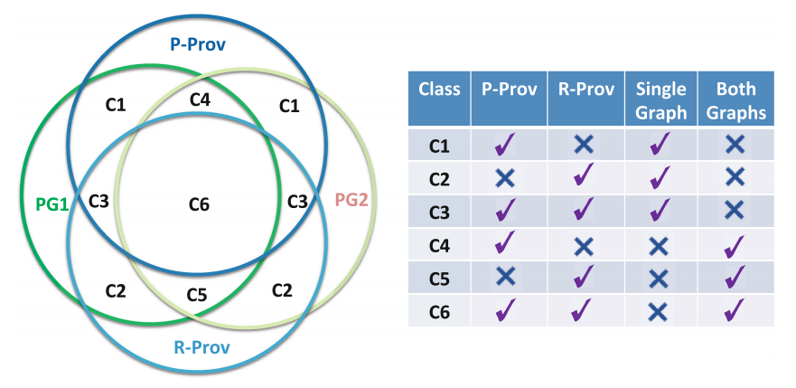

# Running the BigDAWG example

First, we're gonna download BigDAWG. [This fork](https://github.com/yanmendes/bigdawg) provides some scripts we'll be using in this tutorial.

## Requirements

### ⚠️To run the following example, I'm assuming you're using an Unix-based distribution (MacOS or Linux). If you're using a Windows machine, some commands may change.

All you need [Docker](https://www.docker.com/) to run this example. To install it, just see the guide for your OS:

- [MacOS](https://docs.docker.com/docker-for-mac/install/)

- [Windows](https://docs.docker.com/docker-for-windows/install/)

- [Ubuntu](https://phoenixnap.com/kb/how-to-install-docker-on-ubuntu-18-04)

## Installing BigDAWG with provenance data

First of all, open the `Terminal` program in your computer. Then, clone or [download](https://github.com/yanmendes/bigdawg/archive/master.zip) the repository.

```sh
  git clone https://github.com/yanmendes/bigdawg
```

If you opted for the download, unzip the file and change into your downloads directory in the `Terminal`. Run the script below.

### ⚠️ It usually takes a couple of minutes. You'll notice it's finished when the the last line says `Hit enter to stop it...`.

```sh
  cd bigdawg/provisions && ./setup_polyflow.sh
```

The script starts three Docker containers named `bigdawg-postgres-swift`, `bigdawg-postgres-kepler` and `bigdawg-postgres-catalog`. The first two are relational databases with [provenance data](../Provenance) and the last one is BigDAWG's modified catalog containing `Kepler's` and `Swift's` schema details. To see if your installation was successful, run the following query:

```sh
  curl -X POST -d "bdrel(select * from data);" http://localhost:8080/bigdawg/query/
```

The expected output is:

```
  contents        truncated       md5
  [B@760bf73d     true            3efa76b06a6ecf6b51f45e43fc9d5d53
```

## Connecting polyflow to BigDAWG

If you don't have `polyflow` up and running, you should follow [this guide](https://github.com/yanmendes/polyflow#running-dockerized-version) first.

Once you have `polyflow` running, open a new shell tab in your `Terminal` (`cmd⌘ + t` or `ctrl + t`), move to this folder (`cd <polyflow-dir-location>/examples/BigDAWG`) and run the script below to automatically:

- Insert BigDAWG as a `data source`;
- Create mediators;
- Insert [Kepler's](./Kepler) and [Swift's](./Swift) entity mappers into `polyflow's` catalog.

If you have BigDAWG OR `polyflow` installed elsewhere, create a new [.env from the template](./.env.sample) file and [override the env_file setting in your `docker-compose`](./docker-compose.yml#L4).

```sh
cd examples/BigDAWG && docker-compose up setup-bigdawg;

# if you're running it on a Ubuntu
sudo docker-compose up setup-bigdawg
```

If everything went well, you should see a `Done!` message in your shell. To make sure everything is working, connect to `polyflow` (the default URL is [http://localhost:3050/](http://localhost:3050/)) and run the following query on the playground:

```graphql
query query {
  query(query: "bdrel(select * from kepler[provone_port])")
}
```

The output on the right hand-side should read:

```json
{
  "data": {
    "query": [
      {
        "port_id": "22",
        "port_type": "out",
        "label": ".Constant.output"
      },
      {
        "port_id": "23",
        "port_type": "in",
        "label": ".Constant.trigger"
      },
      {
        "port_id": "30",
        "port_type": "in",
        "label": ".Display.input"
      },
      {
        "port_id": "37",
        "port_type": "out",
        "label": ".Constant2.output"
      },
      {
        "port_id": "38",
        "port_type": "in",
        "label": ".Constant2.trigger"
      },
      {
        "port_id": "45",
        "port_type": "out",
        "label": ".Constant3.output"
      },
      {
        "port_id": "46",
        "port_type": "in",
        "label": ".Constant3.trigger"
      },
      {
        "port_id": "53",
        "port_type": "out",
        "label": ".Constant4.output"
      },
      {
        "port_id": "54",
        "port_type": "in",
        "label": ".Constant4.trigger"
      },
      {
        "port_id": "61",
        "port_type": "out",
        "label": ".Constant5.output"
      },
      {
        "port_id": "62",
        "port_type": "in",
        "label": ".Constant5.trigger"
      }
    ]
  }
}
```

Now you have a running instance of `polyflow` connected to BigDAWG and populated with provenance data. The next section describes the setup to assess the results for queries run in the experiment.

## Installing a SQL IDE

To assess the results of queries, you can use a SQL IDE of your preference and query the raw data directly. If you don't have one, we suggest using SQLPad, since it's browser-based and simple to install since it's already bundled in docker-compose.

### **⚠️ If you already have a SQL IDE, you can skip to [this section](#connecting-raw-databases)**

All you need to install SQLPad is run the script below. **Remember to use the `-d` flag, so you don't lock-in your terminal with unnecessary logs**

```sh
docker-compose up -d sqlpad

# if you're running it on a Ubuntu
sudo docker-compose up -d sqlpad
```

Once it's done, open [http://localhost:5000](http://localhost:5000) on your browser and click [`Sign up`](http://localhost:5000/signup). You can enter any email and password you like. Finally, [`Sign in`](http://localhost:5000/signin) with your credentials. You should see a big white screen with an action bar at the top.

## Connecting to origin databases

To add a database in SQLPad, you should click `...New connection` on the navigation bar on the top of the page. Once you do, name your connection (I suggest using `Kepler`, but you can write anything); Then choose `Postgres` driver. Finally, fill in the following fields:

- `Host/Server/IP Address`: `bigdawg-postgres-kepler`
- `Port (optional)`: `5401`
- `Database`: `kepler`
- `Database username`: `postgres`

Now, scroll down and click on `Test`. It should show a green check mark. `Save` your changes. Repeat the process for `Swift`. `...New connection`, name it, choose the `Postgres` driver and write the connection details:

- `Host/Server/IP Address`: `bigdawg-postgres-swift`
- `Port (optional)`: `5402`
- `Database`: `swift`
- `Database username`: `postgres`

### **⚠️ If you are using a SQL editor in your own computer, note that the `Host` will change, since it's not in the docker network. You should use `localhost` instead.**

## Queries ran in the experiment

There are 6 classes of provenance query types using two provenance datasets:

<div style='text-align: center;'>
  
  <p>Extracted from <a href='https://link.springer.com/chapter/10.1007/978-3-319-40593-3_5'>this paper</a></p>
</div>

In this experiment we'll showcase one query belonging to each class. The query index (e.g., Q**1**) corresponds to the class (e.g., C**1**)

- **Q1**: Retrieve all ports in Kepler's Provenance Graph

```graphql
query Q1 {
  query(query: "bdrel(select * from kepler[provone_port])")
}
```

- **Q2**: Retrieve all activity executions with their generated data for Swift's provenance graph:

```graphql
query Q2 {
  query(
    query: "bdrel(select * from swift[provone_execution] as e join swift[prov_wasGeneratedBy] as wgb on e.execution_id = wgb.execution_id)"
  )
}
```

- **Q3**: Retrieve data used in an workflow enactment and their corresponding port for Kepler's workflow.

```graphql
query Q3 {
  query(
    query: "bdrel(select * from kepler[prov_usage] as u inner join kepler[provone_port] as p on u.kepler_provone_hadInPort = p.kepler_port_id)"
  )
}
```

- **Q4**: Connect all Kepler's ports to Swift's Programs

```graphql
query Q4 {
  query(
    query: "bdrel(select * from kepler[provone_port] left join (select * from swift[provone_program]) as programs on 1=1)"
  )
}
```

- **Q5**: Fetch all programs' execution duration

```graphql
query Q5 {
  query(
    query: "bdrel(select * from (select duration from swift[provone_execution]) as t1 left join (select EXTRACT(SECOND FROM prov_endedAtTime - prov_startedAtTime) from kepler[provone_execution]) as t2 on 1=1)"
  )
}
```

- **Q6**: Fetch all programs and executions from both workflows

```graphql
query Q6 {
  query(
    query: "bdrel(select * from kepler[provone_execution] as e inner join kepler[provone_program] as p on p.kepler_program_id = e.kepler_provone_hadPlan left join swift[provone_program] as sp on 1=1 left join swift[provone_execution] as se on se.provone_hadPlan = sp.program_id)"
  )
}
```

## Validating results in original datasets

- **Q1**:

```sql
SELECT
  p.id as port_id,
  CASE WHEN p.direction = 1 THEN 'out' WHEN p.direction = 0 THEN 'in' END as port_type,
  e.name as label
FROM port as p INNER JOIN entity as e ON p.id = e.id
```

- **Q2**:

```sql
SELECT
  app_exec_id as execution_id,
  start_time as prov_startedAtTime,
  script_run_id as provone_hadPlan,
  duration
FROM app_exec as e
INNER JOIN (
  SELECT file_id as entity_id,app_exec_id as execution_id FROM staged_out
) as wgb on e.app_exec_id = wgb.execution_id
```

- **Q3**:

```sql
SELECT
  pe.fire_id as execution_id,
  pe.port_id as provone_hadInPort,
  data as data
FROM
  port_event as pe
INNER JOIN (
    SELECT
      p.id as port_id,CASE
        WHEN p.direction = 1 THEN 'out'
        WHEN p.direction = 0 THEN 'in'
      END as port_type,
      e.name as label
    FROM
      port as p
      INNER JOIN entity as e ON p.id = e.id
) as p on pe.provone_hadInPort = p.port_id
WHERE
  pe.write_event_id = -1
```

- **Q4**:

  - On Kepler's DB:

  ```sql
  SELECT
    p.id as port_id,CASE
      WHEN p.direction = 1 THEN 'out'
      WHEN p.direction = 0 THEN 'in'
    END as port_type,
    e.name as label
  FROM
    port as p
    INNER JOIN entity as e ON p.id = e.id
  ```

  - On Swift's DB:

  ```sql
  SELECT
    script_run_id as program_id,
    script_filename as label
  FROM
    script_run
  ```

  - On BigDAWG's endpoint:

  ```bash
  curl --request POST \
  --url http://localhost:8080/bigdawg/query \
  --header 'content-type: application/json' \
  --data 'bdrel(
  t
  *
  m
  (
  T
  E
  '
  '
  ,
  l
  M
  p
  d
  1
  (
  t
  *
  m
  (
  T
  ,
  l
  M
  n
  3
  1
  )'
  ```

- **Q5**:

  - On Kepler's DB:

  ```sql
    SELECT
      EXTRACT(SECOND FROM end_time - start_time) as duration
    FROM
      actor_fire as af
  ```

  - On Swift's DB:

  ```sql
  SELECT
    duration
  FROM
    app_exec
  ```

  - On BigDAWG's endpoint:

  ```bash
  curl --request POST \
  --url http://localhost:8080/bigdawg/query \
  --data 'bdrel(
  select
    *
  from
    (
      select
        duration
      from
        (
          SELECT
            app_exec_id as execution_id,
            start_time as prov_startedAtTime,
            script_run_id as provone_hadPlan,
            duration
          FROM
            app_exec
        ) as table_7
    ) as t1
    left join (
      select
        EXTRACT(SECOND FROM prov_endedAtTime - prov_startedAtTime) duration
      from
        (
          SELECT
            af.id as execution_id,
            af.start_time as prov_startedAtTime,
            af.end_time as prov_endedAtTime,
            af.wf_exec_id as provone_wasPartOf
          FROM
            actor_fire as af
        ) as table_0
    ) as t2 on 1 = 1
  )'
  ```

- **Q6**:
  - On Kepler's DB:
  ```sql
    SELECT
      *
    FROM
      (
        SELECT
          af.id as kepler_execution_id,
          actor_id as kepler_provone_hadPlan,
          af.start_time as kepler_prov_startedAtTime,
          af.end_time as kepler_prov_endedAtTime,
          af.wf_exec_id as kepler_provone_wasPartOf
        FROM
          actor_fire as af
      ) as e
      INNER JOIN (
        SELECT
          a.id as kepler_program_id,
          e.name as kepler_label
        FROM
          actor as a
          INNER JOIN entity as e ON a.id = e.id
      ) as p on p.kepler_program_id = e.kepler_provone_hadPlan
  ```
  - On Swift's DB:
  ```sql
  SELECT
    *
  FROM
    (
      SELECT
        script_run_id as program_id,
        script_filename as label
      FROM
        script_run
    ) as sp
    inner join (
      SELECT
        app_exec_id as execution_id,
        start_time as prov_startedAtTime,
        script_run_id as provone_hadPlan,
        duration
      FROM
        app_exec
    ) as se on se.provone_hadPlan = sp.program_id
  ```
  - On BigDAWG's endpoint:
  ```bash
  curl --request POST \
  --url http://localhost:8080/bigdawg/query \
  --data 'bdrel(
  select
    *
  from
    (
      SELECT
        af.id as kepler_execution_id,
        actor_id as kepler_provone_hadPlan,
        af.start_time as kepler_prov_startedAtTime,
        af.end_time as kepler_prov_endedAtTime,
        af.wf_exec_id as kepler_provone_wasPartOf
      FROM
        actor_fire as af
    ) as e
    inner join (
      SELECT
        a.id as kepler_program_id,
        e.name as kepler_label
      FROM
        actor as a
        INNER JOIN entity as e ON a.id = e.id
    ) as p on p.kepler_program_id = e.kepler_provone_hadPlan
    left join (
      SELECT
        script_run_id as program_id,
        script_filename as label
      FROM
        script_run
    ) as sp on 1 = 1
    left join (
      SELECT
        app_exec_id as execution_id,
        start_time as prov_startedAtTime,
        script_run_id as provone_hadPlan,
        duration
      FROM
        app_exec
    ) as se on se.provone_hadPlan = sp.program_id
  )'
  ```

## Cleaning up

To stop the execution of the containers, run:

```sh
docker rm -f polyflow polyflow-catalog bigdawg-postgres-catalog bigdawg-postgres-swift bigdawg-postgres-kepler

# if you're running it on a Ubuntu
sudo docker rm -f polyflow polyflow-catalog bigdawg-postgres-catalog bigdawg-postgres-swift bigdawg-postgres-kepler
```

## Adding your own data

To add your own data, refer to the [core concepts section](https://github.com/yanmendes/polyflow#core-concepts)
